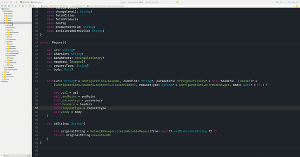

# Xcode Templates

# Usage

## Module:



# Installation

## Module Template

```yml
curl "https://raw.githubusercontent.com/stanwood/Xcode_Templates_iOS/master/Script/install.sh"
```
>Note: You will be asked to enter your password.


## Licence

StanwoodDebugger is under MIT licence. See the [LICENSE](https://github.com/stanwood/Xcode_Templates_iOS/blob/master/LICENSE.md) file for more info.
